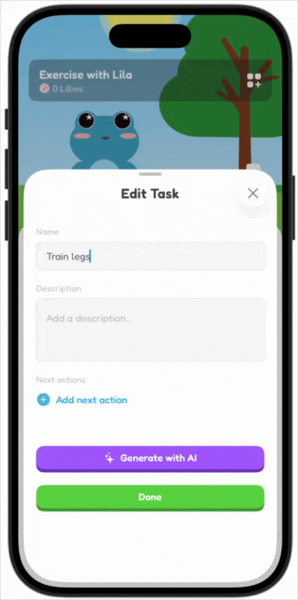
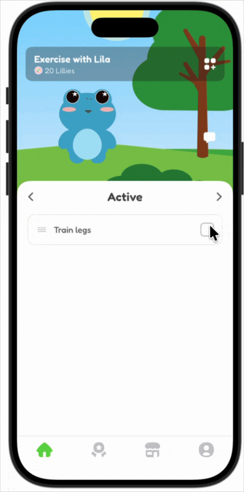
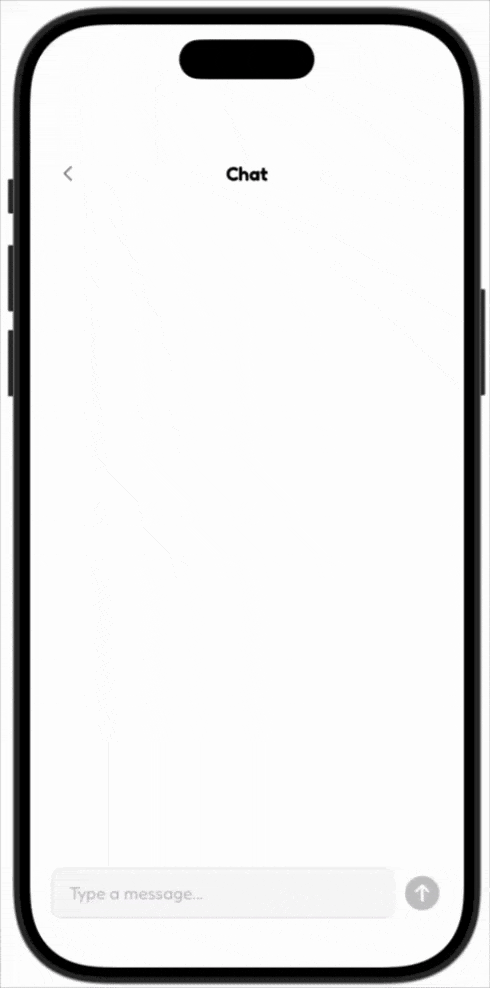

# ____ Productivity
This is the duolingo for productivity!
Built during encode club commit to change hack.

This is the frontend, The back end can be found here: https://github.com/CameronJules/encode-commit-app-backend

I have excluded the name to make it less searchable as I will be putting this on the app store!

# Buddies
Assign a buddy for important groups of work.  
As you complete tasks you can customise each buddy with cool stuff from the shop!  
No more cluttered todos, just a friendly frog for each area!

# Capture, Activate, Complete
Popularised in the getting things done framework.  
Capture tasks without committing, get them off your brain.  
Do them when you are ready.

# Next Actions
Create next actions to get the ball rolling.
Do it yourself or get some help!

# Earn and Shop
Complete Tasks to earn coins and buy items from the shop!

# Emotional Intelligence
When you don’t even know where to start, chat to your buddie for help.  
Feel productive even on low days.

# Satisfying progress
See your task completions in a github style heatmap.  
A satisfying way to look back at how active you’ve been!

